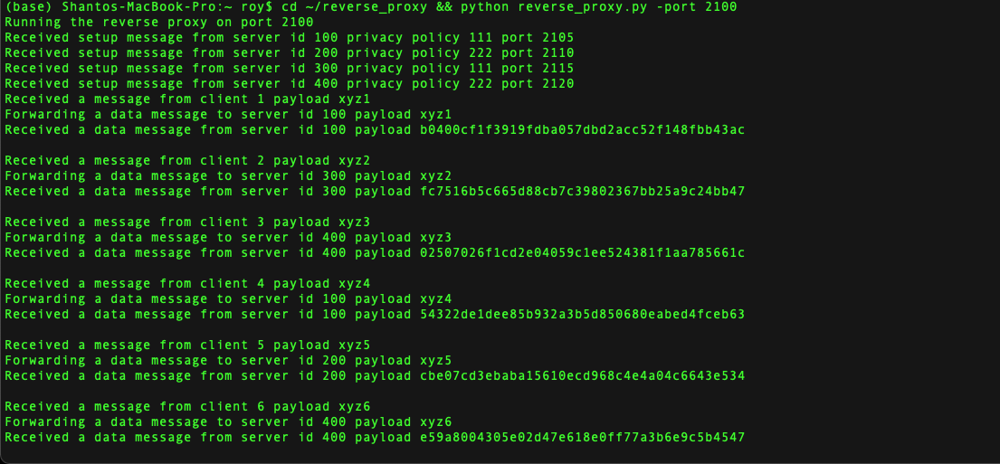
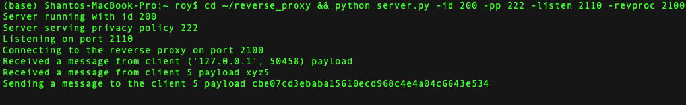
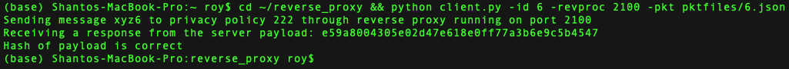

# Simple Reverse Proxy Load-balancing in Python

## Basic Information
* Name - Shanto Roy
* PSID - 1894941
* Course - Computer Networks
* Assignment - Reverse Proxy with Loadbalancing (Round Robin)

## About
The Reverse Proxy keeps track of available servers, receives client data, forwards client data to servers
with corresponding privacy policy based on Round-Robin loadbalancing, receives processed data from servers, and returns the processed data to the clients. Each process is maintained using thread. The socket programming is done using python (version 3.x).


## Setup
1. clone the repository to your **home directory**
2. make sure python (3.x) is selected by default as python (virtual env is preferable)
3. Run `pip install -r requirements.txt `
4. run `./main.sh` in Mac terminal or `./main_linux` in a Linux terminal. Outputs are visible in several terminals.
5. If `./main.sh` or `./main_linux` does not work properly, please open new terminal tabs/windows (after going to the `reverse_proxy` directory) and run the nodes as follows:

    * For the reverse proxy
    ```sh
    $ python reverse_proxy.py -port 2100
    ```

    * Example servers
    ```sh
    $ python server.py -id 100 -pp 111 -listen 2105 -revproc 2100
    ```

    * Example clients
    ```sh
    $ python client.py -id 1 -revproc 2100 -pkt pktfiles/1.json
    ```

N.B. Please note that, you can change any of the argument values (id/pp/listen/revproc). For convenience here, I used only two privacy policies (111/222) for **four** servers and requested services from **six** clients to check if the round robin works properly.


## Examples
### Reverse Proxy


### Server


### Client



## Video Illustration


## Future Work
1. Full Documentation
2. Improve Automation
3. Develop Fault-tolerant Load-balancing features


## Thanks to
* [Stack Overflow](https://stackoverflow.com/)
* [Github](https://github.com)
* Other random tutorials
